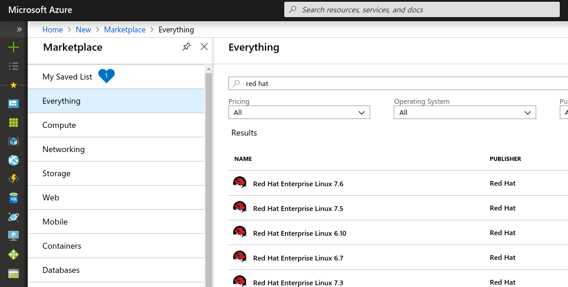
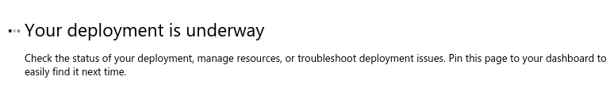
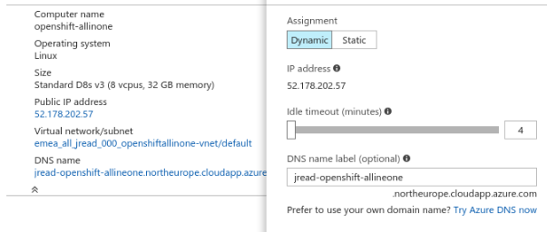
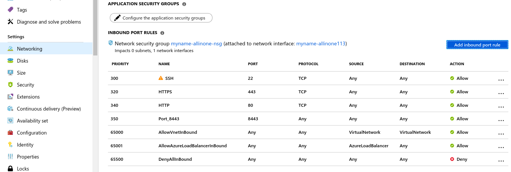
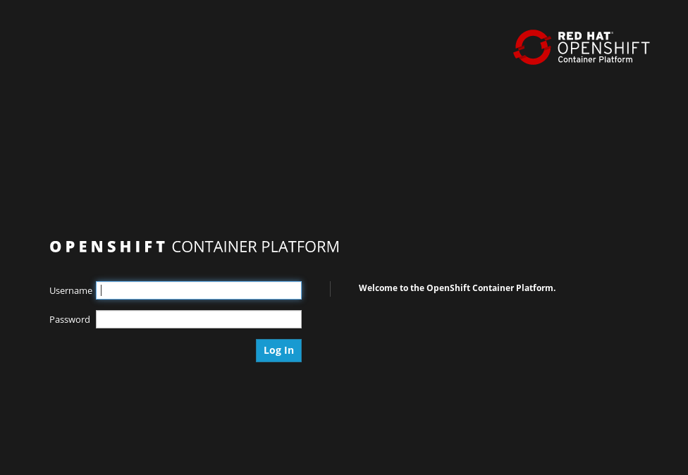

:data-uri:
:toc:

= single-node-openshift-azure-tutorial

== What is this?

This simple tutorial/demo script will talk you through the creation of a single virtual machine (node) on Azure that is running OpenShift. It will use the "oc cluster up" mechanism to deploy OpenShift, which is great just for demos, labs, and that sort of thing. 

This would not be the recommended way for a production deployment of OpenShift on Azure. If you want to learn more about that, then check out this repository instead; http://aka.ms/openshift

=== What do I need before I get started?

1. A working Azure account with at least $50 credit.
2. Access to Red Hat OpenShift Container Platform subscriptions (NFRs, or lab repositories). 

[NOTE]
This lab would also work with OKD (community OpenShift), but the instructions and repositories would be a little different. Unfortunately you are on your own if you want to try OKD!

=== What will I do in this tutorial?

1. You'll need a working Azure subscription and portal login to complete this.
2. Create a Azure RHEL virtual machine and connect to it with SSH.
3. Enable the OpenShift repositories. 
4. Configure Docker, and start a simple "all in one" OpenShift environment.
5. Profit! ... and then run more exciting OpenShift workloads on Azure ;-)

This lab should between 20-30 minutes to complete.

[NOTE]
Instructions may be deliberately brief, **encouraging you to look into the answer 
 a little yourself**. Don’t be upset if some steps take you a little longer to 
 find or fix, but do ask for help if you get stuck too long! 

== Provision a RHEL virtual machine from the marketplace 

Naviate to the Azure Marketplace;

Provision a new RHEL 7.x machine. Use the latest version of RHEL available (7.6 at the time of writing). Use common sense details for the VM hostname, etc.

    * **Authentication Type**: You should use a SSH key if you have one, otherwise, create a **strong password**!
    * **Resource Group**: Create new: __openshift_occlusterup__
    * **Region**: Use a region that is near to you!

image::images/provisioningDialog.png[]

=== Sizing

OpenShift in this environment will run quite happily on 2x CPUs and 8Gb/RAM, but 4x CPUs and 16GB RAM is a lot nicer. If you have the credits available, this lab recomments using a **D4s_v3** sized virtual machine on Azure.

=== Disks

Use managed disks if prompted. OpenShift will work just find with a Standard HDD storage, but if you have the credits available, select a **Premium SSD**.

=== Start the provisioning, and wait for it to complete

When complete, go and find the virtual machine;

=== Set a DNS name

When the virtual machine has been provisioned, set a DNS name in the virtual machine overview and take a note of the public IP address in your notes.

=== Edit the Network Security Groups, and add a few basic rules; 

Port 8443, 22, and 80 should be open. You should add these as inbound ports in the network security group.

=== SSH into your VM

Use your favorite SSH client (if you're on Windows, download PuTTY) to connect to the OpenShift virtual machine. You need to use the username and ssh key/password specified during the provisioning process.

Get ready for some OpenShifting :-)

== Prepare the machine for OpenShift

=== Become root

All instructions in the rest of the lab guide require root access, and to be in the root home directory.

    sudo su
    cd /root/

=== Disconnect from Red Hat Update Infrastructure; 

RHEL machines provisioned from the marketplace come connected to Red Hat Update Infrastructure. However, Red Hat Update Infrastructure is for RHEL only, not OpenShift.

    rpm -e rhui-azure-rhel7

=== Configure OpenShift repositories

In the next section, choose __Option A__ **or** __Option B__. Don't do both :-)

==== Option a) If you have a working Red Hat subscription; 

    subscription-manager register
    Username: …
    Password: …

Find a pool ID with OpenShift, and make a note of the pool ID.

    subscription-manager list --available

Attach to this pool;

    subscription-manager attach --pool=...

Disable all default repos, and then attach to the required repos.

    subscription-manager repos --disable '*'

    subscription-manager repos --enable 'rhel-7-server-rpms'
    subscription-manager repos --enable 'rhel-7-server-extras-rpms'
    subscription-manager repos --enable 'rhel-7-server-ose-3.11-rpms'

==== Option b) If you have a repository provided by your lab administrator; 

    cd /etc/yum.repos.d/
    wget http://YOUR-ADDRESS-HERE.cloudapp.azure.com/repos/lab.repo 

=== Install the `oc` client, Docker and Git

    yum install atomic-openshift-clients docker git -y

=== Setup Docker

Add the insecure registry options in the docker configuration file `/etc/docker/daemon.json`; 

    { "insecure-registries": ["172.30.0.0/16"] }

Make docker start on boot, and then start it manually;

    systemctl enable docker
    systemctl start docker

////
=== Configure iptables

    service iptables start
    iptables -F INPUT
////

=== Turn off the firewall for simplicity

    systemctl stop firewalld
    systemctl disable firewalld

=== Login to the Red Hat Container Registry

    docker login https://registry.redhat.io
    Username: ...
    Password: ...

=== Start OpenShift

We're going to run OpenShift, running inside a container. It will take about 10 minutes to come up and should be fully automatic.

    oc cluster up --enable '*,automation-service-broker,service-catalog,template-service-broker' --public-hostname=<yourDnsName>.azure.com --routing-suffix=<yourPublicIpAddress>.nip.io

**Note**: You must use a valid DNS name (or IP address with nip.io) or the cluster may hang trying to contact itself when starting. 

=== Login to the web interface

https://<yourDnsName>.azure.com:8443/console

Have a little look around ;-) You can login as *developer* with any password.

== Add .NET support from CentOS

On the virtual machine, enter this command; 

    oc cluster add centos-imagestreams

== Service Broker for Azure

Installing the Open Service Broker for Azure is a 2-step process. The first step is getting a service principal, the second issue is then installing the service broker. 

=== Create a service principal 

A service broker is like a "username and password" to have admin access for Azure.

https://docs.microsoft.com/en-us/azure/active-directory/develop/howto-create-service-principal-portal

=== Install the service broker

Install the service broker using instructions from here;

https://github.com/Azure/open-service-broker-azure#openshift-project-template

== What can I try now? 

1. Deploy `php-ascii-pets`; https://github.com/jamesread/php-ascii-pets.git 
2. If you know quite a lot about OpenShift already, but not Azure, start from challenge #7; https://github.com/palma21/openshiftlab#challenge--7-monitoring-openshift-with-azure-oms
3. If you know quite a lot about Azure already, but not OpenShift, start from challenge #2; https://github.com/palma21/openshiftlab#challenge--2-create-and-manage-projects
4. .NET and Azure focussed OpenShift demo; https://github.com/city-breaks-on-openshift
5. If you fancy a challenge; https://github.com/jbossdemocentral/coolstore-microservice
